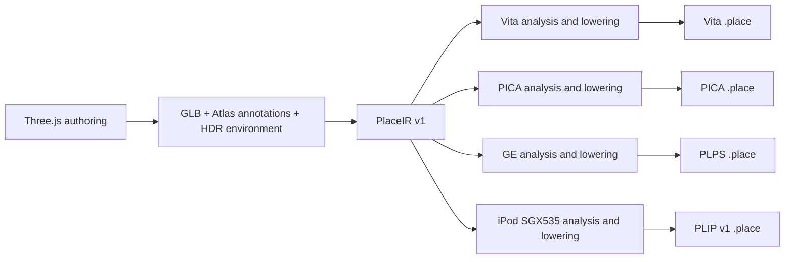

# Place compiler and shared device mechanisms

Pocket Atlas owns its authoring conventions, PlaceIR, cooking passes, device
packs and renderers. OpenStrike owns BSP/FPS behavior. Pocket3D names the family
of techniques used to build these systems. Sharing a device kernel does not
require sharing a scene engine, material model or runtime ABI.

## Milestone 1



All four cooks start from the same immutable source. PICA, GE and iPod do not
parse a Vita pack, decompress its BC textures, or reconstruct positions from
its quantized vertices. Shared analysis passes still perform world transforms,
spatial chunking, lighting and animation sampling. PICA / GE now receive float
positions, normals, tangents and UVs and original material pixels. Their own
lowerings choose texture sizes/layouts, vertex layouts, lighting approximations,
batching and runtime data. Vita retains its existing encoding and shaders.

`crates/pocket3d-place-cook/src/ir.rs` implements import, integrity checks and
capability checks. `source.rs` describes transient shared-pass output; it is not
a serialized interchange format. `main.rs` still orchestrates the existing
analysis and Vita writer; `pica.rs`, `psp.rs` and `gles.rs` own native lowerings. Existing
`pocket3d-place::Meta` types are reused internally during this migration. They
are not the public definition of PlaceIR. Vita/PICA/GE device format names/versions remain unchanged. The iPod target
owns the separate PLIP v1 contract described below. PICA pins
its PLCE envelope to v5 and its binary table to v3 independently of Vita v6.
Previously a Vita version bump leaked into PICA output and the C reader rejected
it; the integration test now checks cooked output using the runtime's C format
header and header validator.

## PlaceIR v1

A directory contains:

- `manifest.json`: version, stable place name, kind, required known effects and
  SHA-256 of every resource. Unknown IR versions and changed resources fail.
- `scene.gltf`: canonical JSON using glTF 2.0 structure plus `extras.pocketAtlas`.
  It preserves authored nodes, materials, cameras, motion and Atlas annotations.
- `scene.bin`: the original GLB buffer, including original embedded images.
- `env.rgba16f` and the authored cloud image when referenced by scene metadata.

Import splits an exported GLB and seals its resources. It does not quantize
geometry, compress textures, bake lighting, choose LODs or discard metadata.
This is an incremental IR built on the existing structural schema, not a new
general-purpose scene language. No backend calls Three.js or requires a browser.
The exporter remains responsible for converting supported Three.js constructs
into geometry and annotations; arbitrary JavaScript, GLSL and gameplay code do
not become portable automatically. Sampled traffic contains the exported time
interval. Doors, camera controls and animation evaluation remain runtime code.

Reproducibility starts at a fixed export / PlaceIR and pinned compiler/dependency
revision. Procedural web authoring may use time or randomness; creating a new
export is not promised to reproduce an earlier export. Cook timing is kept out
of the device metadata so repeated cooks can produce identical bytes. Cross-OS
floating-point or compiler-version identity is not established by the current
same-host regression tests.

## Commands

Export a place using `web/scripts/export-place.ts`, then import it once:

```sh
cargo run --locked --release -p pocket3d-place-cook -- import \
  --in .pocket-build/places/tokyo-konbini \
  --out .pocket-build/places/tokyo-konbini/place.ir

# The export and browser are no longer needed after import.
for target in vita 3ds psp ipod; do
  cargo run --locked --release -p pocket3d-place-cook -- check \
    --in .pocket-build/places/tokyo-konbini/place.ir --target "$target"
  cargo run --locked --release -p pocket3d-place-cook -- \
    --in .pocket-build/places/tokyo-konbini/place.ir --target "$target" \
    --out ".pocket-build/validation/tokyo-$target.place" --tex 256
done
```

The platform wrappers (`tools/atlas.ts cook`, `atlas-3ds.ts cook`,
`atlas-psp.ts cook`) import the current export before lowering. The iPod asset
workflow runs the explicit import and lowering commands in `ipod/README.md`. Passing an IR
folder to the compiler checks its hashes and does not modify it. A device pack
is never a compiler input. The removed `--pica-from`, `psp --in <pack>` and `gles --in <pack>` forms
fail with a migration message.

`--tex` retains the Vita/PICA texture cap setting; PSP currently uses its own
128/512-pixel material policy. Output suffixes do not identify a universal pack:
PICA has its own table and geometry layout; PSP uses the separate PLPS header.
PICA's higher-resolution exceptions inspect the authored 4K text-atlas
convention, animation grids and emissive strips. Ordinary 2K source maps obey
the texture cap; their original size must not be mistaken for a previously
resized Vita atlas. The writer checks the reader's per-section limits (4 MiB
table, 12 MiB textures, 24 MiB geometry, 16 MiB animation) before publishing.
These are structural ceilings; combined allocations and render targets still
need device headroom measurements.

## Capability, release eligibility and evidence

`check --target` rejects known missing lowerings before cooking. Currently
PICA/GE reject city-light fields and vista height haze. GE also rejects daytime
sky, water and kinds outside the supported night-street effect set. It does not
silently treat light-field point records as triangle records. Unsupported
material annotations fail rather than falling back to a standard material.
This is an initial capability gate, not an exhaustive Three.js feature checker.

The web registry's `targets` controls which native catalogs may publish a place;
`load` only means it can be entered on the web. In particular, Griffith stays
web/Vita/iPod-only and is not offered as runnable in the 3DS catalog. A compiler check
can reject a registered place if its authored feature requirements change.
Future device receipts can replace this manually maintained release eligibility.

A successful cook establishes asset construction and structural checks. A host
build establishes binding/link compatibility. Console launch, SceShaccCg
compilation, scene switching, visual fidelity and measured frame budgets are
separate checks. Native output has changed for PICA/GE because it now retains
source precision and avoids the BC round trip; existing hardware measurements
must not be treated as measurements of these new artifacts.

The regression test `tests/pipeline.rs` imports a small textured scene, deletes
the web export, compiles iPod, PSP and PICA before Vita, validates the PSP payload,
checks retained float precision and non-power-of-two texture fitting, then
repeats every cook byte-for-byte. Another fixture exercises the PICA sizing
policy with an ordinary 2K source image. IR tests cover retained unknown metadata,
version/capability and resource integrity. Run `cargo test --locked --workspace`.

## iPod SGX535 lowering

`--target ipod` reads the same sealed PlaceIR, then consumes shared float meshes,
source RGBA material images, lighting analysis and sampled animation directly.
There is no Vita serialization, BC decode or quantized-vertex round trip in
this path. `gles_geometry.rs` is the target writer, not a pack transcoder.
The removed balanced/throughput re-quantization and tint-material adapter are
replaced by source precision and the display-state page compiler.

`pocket3d_place::ipod` owns `PLIP` magic, version **1**, checked section parsing
and the runtime/cooker vertex contract. `META.version` is also 1. Surface
attributes are little-endian f32: position at 0, normal at 12, tangent at 24,
UV at 40; RGBA8 vertex color at 48. Static/Baked/Skinned strides are 52/56/60
bytes; baked RGBM or skin joints/weights follow at 52. Light fields retain
the directly encoded 40-byte LightPoint records from shared analysis. Original
material semantics, source draw identities, full indices, all LODs and complete
animation tracks are retained. PLIP is not accepted by the Vita reader.

The SGX source-geometry policy adds 1, 2 and 4 cm LOD candidates for static
draws before target encoding. It uses the shared simplifier's attribute weights,
chunk-edge locks and complete-part detail policy, and keeps the original shared
LOD indices/errors unchanged. Only useful intermediate levels are inserted;
dynamic geometry and the Vita/PICA/PSP policies are unchanged. The runtime's
distance/error threshold is unchanged. These error values retain the shared
simplifier/detail-removal meaning, not a new strict screen-space error guarantee.

RGBA8 mips are generated from original source pixels, with linear-light color
filtering, alpha premultiplication, independent data channels and normalized
normals. Images fit power-of-two dimensions under `--tex`; flipbook boundaries
and authored partial-mip limits are explicit shared-analysis policy. Environment
roughness levels retain half-float radiance and are resized independently.
There is no compressed-device texture fallback. A texture or vertex source
that violates this contract fails instead of silently truncating.

Optional `--ipod-pvrtctool /explicit/path/to/PVRTexToolCLI` enables target-native
PVRTC1 RGB4 storage. The executable is never searched for implicitly. The cooker
passes the already filtered RGBA mip chain to `PVRTCBEST` without resizing,
generating mips or changing numerical color space, decodes the result, and checks
all mip levels. Only square power-of-two Color/RGBA8 textures of at least 8 pixels
whose every source alpha is 255 are candidates. Gate v1 requires RGB-byte PSNR
at least 38 dB overall and 36 dB in every mip, maximum channel error at most
32/255, and RGB-byte RMSE at most 8/255 in every aligned 8×8 block (including
partial blocks). Text, signs and detailed atlases often fail these local gates;
there are no scene or texture-name exceptions.

Accepted entries in `META.ipod_recipes.pvrtc` describe independent `IPTX` ranges,
dimensions, mip count, codec/gate version 1 and measured quality. `sourceHash`
binds every original RGBA mip byte and `payloadHash` binds exactly the compressed
range using FNV-1a64 (cache identity, not a security signature). Each mip occupies
`max(width,8) * max(height,8) / 2` bytes. Original `TEXD` and `Texture::format` are
unchanged for the reference renderer. The performance renderer may use accepted
recipes; no tool configured or a rejected quality gate keeps its existing
uncompressed storage policy. A configured tool failure or malformed PVR output
is an error, not a silent fallback. `.ipod-texture-receipt.json` records the
executable SHA-256/version, fixed arguments and accepted/rejected measurements;
machine paths stay out of the pack. Reproducing compressed bytes requires the
same tool binary in addition to the normal compiler/IR inputs. PVRTexTool is an
external proprietary tool; the repository neither bundles nor redistributes it.
Compression quality, device memory use and measured GPU frame time are distinct
evidence; passing the offline gate does not establish a frame budget.

`META.ipod_recipes.display_cubes` moves the Glass/Water display environment into
immutable compiler output. Recipe v1 averages linear source environment radiance
into the existing octahedral map of at most 64×64, applies the complete scene
grade at the exact material/environment strength, and reprojects into six 64²
RGBA8 faces. `IPEN` stores +X, −X, +Y, −Y, +Z, −Z faces, 98,304 bytes per cube,
without mipmaps. Materials with identical strength bits share one cube. Source
ENV and the reference path remain unchanged. Each recipe binds the original
complete ENV mip payload together with its serialized `(format, width, height,
mips, role)` interpretation, serialized `Post`, strength, material indices and cube
bytes; no place-name policy is involved. `pc::ipod::display_environment` contains
the shared pure math used by this lowering and the legacy startup fallback.

The optional `.ipod-color.bin/.json` recipe compiles display-referred vertex
colors and float position/UV/color pages. Pages merge only identical residual
render state; source draws still select visibility and LOD independently.
`.ipod-clusters.bin` partitions complete connected parts into 4 m groups and
16 m triangle clusters without moving vertices or changing any full/LOD triangle
multiset. Both are identity-bound to their target pack. These are target output
artifacts, not alternative compiler inputs. Rebuild all of them from PlaceIR.

Static opaque Products without animated UV/emission can additionally compile
`products-appearance` recipe v1. It evaluates the existing packaging seed,
base/atlas blend, cap/side gate, item-height shading and scene grade into a
32-pixel tile with a 2-pixel border per seed (generated atlas at most 1024²).
The performance page remaps UVs, keeps every position,
and uses opaque white vertex color with flag 64. Original Products geometry,
material and texture remain available to the reference shader. The loader
requires the declared recipe and legal atlas UVs; ordinary pages still require
exact source UVs. Arbitrary Products meshes whose height/UV/seed interpolation
cannot be represented, and materials with animation, keep their original path.
The receipt records sampled display RGB RMSE/max error, the finite texture
sampling approximation and height-parameter error. It is not a pixel-equivalence
claim or proof of a device frame budget.

Color sidecar v3 can additionally lower an appearance-baked Products LOD when
every triangle has an exact reverse-winding partner with identical final
position, UV and RGBA bytes. Degenerate, unmatched or differently mapped faces
retain the complete original level. The shared `ipod::display_indices` proof
retains one original triangle per pair, and a derived display state disables
culling; every other render-state field stays equal. This relies on the
normal-independent Products appearance shader and does not generalize to
arbitrary two-sided materials. Original GEOM, full/reference indices and LOD
selection/error values are unchanged.

In v3 `vertexBytes` ends the original float-page/raw-color prefix; u16 indices
are appended to the same `.ipod-color.bin`. `colorsBytes` and `colorsHash` cover
the whole file. Typed `indexOverrides` entries contain `draw`, `source`,
`indices` and `state`. Both ranges are byte ranges: `source` is a complete LOD
in original GEOM, while `indices` uses the absolute color-file offset. The
replacement values remain source-local and gain the original page base only
at submission. The loader repeats the shared proof and requires the exact
result, in addition to source/payload identity and range validation. Existing
v2 sidecars have only the vertex prefix and no overrides.

Rebuild an iPod candidate without web/browser/device work:

```sh
cargo run --locked --release -p pocket3d-place-cook -- import \
  --in .pocket-build/places/tokyo-konbini \
  --out .pocket-build/validation/ipod-source/ir/tokyo-konbini
cargo run --locked --release -p pocket3d-place-cook -- \
  --in .pocket-build/validation/ipod-source/ir/tokyo-konbini --target ipod \
  --out .pocket-build/validation/ipod-source/tokyo-konbini.place --tex 512
```

The pipeline regression cooks iPod before Vita after deleting the export,
checks source position bits, original color pixels, independent format identity,
and repeated pack/color/cluster bytes. Unit tests cover texture semantic
filtering, malformed payloads, display state, precise full/LOD partitioning and
Products bake/fallback contracts. Hardware acceptance at 480×320 remains a
separate measurement; older sub-480 renders do not establish this target's budget.

## GXM ownership

`vendor/pocketjs/devices/vita/pocket-vita-gxm` contains the shared GXM memory,
program, patcher, target and texture mechanisms extracted from Atlas. Atlas uses
it directly. The existing BSP Vita renderer used by OpenStrike reuses its
mapped-memory and shader-registration operations, preserving its own shaders
and pass structure. Runtime SceShaccCg is an optional feature enabled by Atlas.
Both applications pin the same PocketJS revision; Atlas has no copied local GXM
crate. PocketJS continues to own hosts, transport and packaging.

The kernel exposes GXM concepts. Callers must wait for GPU completion before
freeing resources. It does not select lights, materials, visibility, quality
levels, frames, presentation or an application's device profile. Details and
lifetime rules are in the kernel's README.

## Next extractions

1. Separate the shared analysis result from legacy device metadata completely;
   move Vita serialization out of the orchestration module. Keep source IR
   stable and give target recipes/diagnostics explicit versions.
2. Move BSP/FPS renderer/compiler ownership toward OpenStrike without moving
   generic animation/mesh code or breaking PocketJS's existing widget consumers.
   The current BSP renderer still physically lives in PocketJS during this step.
3. Extract PICA/GE mechanisms from actual consumers when reuse is demonstrated.
   Do not create empty backends or a mandatory common GPU API first.
4. Add target profiles made of OS/ABI, GPU capabilities, budgets and presentation
   requirements. Steam Deck or an Android handheld such as AYN Thor can share
   suitable mechanisms while selecting different compiler recipes. A product
   name alone is not a rendering backend. No new device support is implied here.
5. Publish creator-facing validation, diagnostics and measured capability
   profiles. New scene kinds need a reviewed lowering and visual/performance
   evidence; agents may propose changes, while checked-in compiler passes make
   accepted decisions reproducible. Scene-specific generated patches are not
   part of the asset build.
