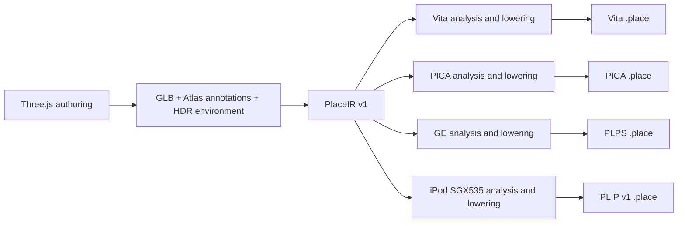

# Place compiler and shared device mechanisms

Pocket Atlas owns its authoring conventions, PlaceIR, cooking passes, device
packs and renderers. OpenStrike owns BSP/FPS behavior. Pocket3D names the family
of techniques used to build these systems. Sharing a device kernel does not
require sharing a scene engine, material model or runtime ABI.

## Compiler stages



All four cooks start from the same immutable source. PICA, GE and iPod do not
parse a Vita pack, decompress its BC textures, or reconstruct positions from
its quantized vertices. Shared analysis passes still perform world transforms,
spatial chunking, lighting and animation sampling. PICA / GE now receive float
positions, normals, tangents and UVs and original material pixels. Their own
lowerings choose texture sizes/layouts, vertex layouts, lighting approximations,
batching and runtime data. Vita retains its encoding and shaders, including solid PBR palette batching.

`crates/pocket3d-place-cook/src/ir.rs` implements import, integrity checks and
capability checks. `source.rs` describes typed transient shared-pass output: float vertices,
logical index lists, original pixels, light points and sampled animation arrays.
It contains no device version, byte ranges or GPU vertex layouts.
`pocket-atlas-model` owns Atlas material, lighting and camera semantics; device
readers re-export those types for compatibility. `analysis.rs` applies scene
passes, while `vita.rs`, `pica.rs`, `psp.rs` and `gles.rs` own their encodings. `main.rs`
handles the CLI. The analysis representation is not a serialized interchange
format or a shared scene language for OpenStrike. Vita uses PLCE/ATLS v7 and META v7. PICA pins its PLCE envelope to v5 and
its binary table to v3 independently. PSP uses PLPS v3 with explicit texture
precision; all packs require their matching target readers.
Previously a Vita version bump leaked into PICA output and the C reader rejected
it; the integration test now checks cooked output using the runtime's C format
header and header validator.

The current recipes preserve full-attribute welds, deformation and palette
seams, bounded rigid simplification, world-scaled motion errors and oversized
triangle boundaries. Vita alone selects solid PBR palette batching and merges
GPU-identical encoded vertices; that representation never enters PICA/GE/iPod.
PICA keeps the two coarsest analysis LODs in its limited main-view slots. Vita
interns identical geometry/animation buffers at serialization. Unsupported skin
sizes fail before publication; omitted inverse-bind matrices use identity.

## PlaceIR v1

A directory contains:

- `manifest.json`: version, stable place name, kind, required known effects and
  SHA-256 of every resource. Unknown IR versions and changed resources fail.
- `scene.gltf`: canonical JSON using glTF 2.0 structure plus `extras.pocketAtlas`.
  It preserves authored nodes, materials, cameras, motion and Atlas annotations.
- `scene.bin`: the original GLB buffer, including original embedded images.
- `env.rgba16f` and the authored cloud image when referenced by scene metadata.

Import splits an exported GLB and seals its resources. It does not quantize
geometry, compress textures, bake lighting, choose LODs or discard metadata.
This is an incremental IR built on the existing structural schema, not a new
general-purpose scene language. No backend calls Three.js or requires a browser.
The exporter remains responsible for converting supported Three.js constructs
into geometry and annotations; arbitrary JavaScript, GLSL and gameplay code do
not become portable automatically. Sampled traffic contains the exported time
interval. Doors, camera controls and animation evaluation remain runtime code.

Authoring definitions now supply a checked seed/sampling/resource contract.
Fresh exports prevent preview time from advancing actors, use fixed sampling,
preserve source IDs and canonicalize asynchronous GLB buffer placement. The
export receipt seals source/resources and browser/GPU identity; matching fresh
exports are verified on the same recorded environment. Cross-browser/GPU identity
is not promised for procedural GPU baking. From a sealed PlaceIR and pinned
compiler/dependencies, target packs and compile receipts are repeatable without
a browser. See [Authoring](AUTHORING.md) for the complete creator workflow,
compatibility adapter, limits and device evidence contract.

## Commands

`bun tools/place.ts inspect|export|import|check|cook|build|report|recipe|profiles`
is the Atlas creator entry point. The Rust commands below remain available for
CI and callers that already have sealed inputs.

Export a place using `web/scripts/export-place.ts`, then import it once:

```sh
cargo run --locked --release -p pocket3d-place-cook -- import \
  --in .pocket-build/places/tokyo-konbini \
  --out .pocket-build/places/tokyo-konbini/place.ir

# The export and browser are no longer needed after import.
for target in vita 3ds psp ipod; do
  cargo run --locked --release -p pocket3d-place-cook -- check \
    --in .pocket-build/places/tokyo-konbini/place.ir --target "$target"
  cargo run --locked --release -p pocket3d-place-cook -- \
    --in .pocket-build/places/tokyo-konbini/place.ir --target "$target" \
    --out ".pocket-build/validation/tokyo-$target.place" --tex 256
done
```

The platform wrappers (`tools/atlas.ts cook`, `atlas-3ds.ts cook`,
`atlas-psp.ts cook`) import the current export before lowering. The iPod asset
workflow runs the explicit import and lowering commands in `ipod/README.md`. Passing an IR
folder to the compiler checks its hashes and does not modify it. A device pack
is never a compiler input. The removed `--pica-from`, `psp --in <pack>` and `gles --in <pack>` forms
fail with a migration message.

`--tex` overrides the selected profile's surface texture cap. PSP defaults to
128-pixel night surfaces, 256-pixel daytime surfaces and 512-pixel emissive/detail maps. PICA defaults to 256.
Profiles validate overrides against the selected backend's limits. Output suffixes do not identify a universal pack:
PICA has its own table and geometry layout; PSP uses the separate PLPS header.
PICA's higher-resolution exceptions inspect the authored 4K text-atlas
convention, animation grids and emissive strips. Ordinary 2K source maps obey
the texture cap; their original size must not be mistaken for a previously
resized Vita atlas. The writer checks the reader's per-section limits (4 MiB
table, 12 MiB textures, 24 MiB geometry, 16 MiB animation) before publishing.
These are structural ceilings; combined allocations and render targets still
need device headroom measurements.

## Capability, release eligibility and evidence

`check --target` rejects known missing lowerings before cooking. Currently
PICA/GE reject city-light fields and vista height haze. GE also rejects water
and kinds outside night streets and dry daytime
streets/slopes. Its shared daytime lowering bakes the sky and sun from the IR.
The GE analysis includes static sunlight before refinement/LOD, with an explicit
transient `baked_sun` marker to avoid applying it twice. Its contact guard and
intact source-window overlays are native sampling policies; the authored IR and
Vita/PICA sunlight paths remain independent (see `psp/README.md`).
PLPS v3 records per-texture precision (RGBA8888 gradients/glossy maps, compact
RGBA4444 for other surfaces) and a bounded sky mesh. It does not
silently treat light-field point records as triangle records. Unsupported
material annotations fail rather than falling back to a standard material.
This is an initial capability gate, not an exhaustive Three.js feature checker.

The web registry's `targets` controls which native catalogs may publish a place;
`load` only means it can be entered on the web. In particular, Griffith stays
web/Vita/iPod-only and is not offered as runnable in the 3DS catalog. A compiler check
can reject a registered place if its authored feature requirements change.
Future device receipts can replace this manually maintained release eligibility.

A successful cook establishes asset construction and structural checks. A host
build establishes binding/link compatibility. Console launch, SceShaccCg
compilation, scene switching, visual fidelity and measured frame budgets are
separate checks. The earlier PlaceIR migration changed PICA/GE output to retain source precision
and avoid the BC round trip. This typed-analysis refactor preserves the current
pack bytes for sealed regression inputs. Measurements still belong to the exact
asset and runtime identities tested.

The regression test `tests/pipeline.rs` imports a small textured scene, deletes
the web export, compiles iPod, PSP and PICA before Vita, validates the PSP payload,
checks retained float precision and non-power-of-two texture fitting, then
repeats every cook byte-for-byte. Another fixture exercises the PICA sizing
policy with an ordinary 2K source image. IR tests cover retained unknown metadata,
version/capability and resource integrity. Run `cargo test --locked --workspace`.

## iPod SGX535 lowering

`--target ipod` reads the same sealed PlaceIR, then consumes shared float meshes,
source RGBA material images, lighting analysis and sampled animation directly.
There is no Vita serialization, BC decode or quantized-vertex round trip in
this path. `gles_geometry.rs` is the target writer, not a pack transcoder.
The removed balanced/throughput re-quantization and tint-material adapter are
replaced by source precision and the display-state page compiler.

`pocket3d_place::ipod` owns `PLIP` magic, version **1**, checked section parsing
and the runtime/cooker vertex contract. `META.version` is also 1. Surface
attributes are little-endian f32: position at 0, normal at 12, tangent at 24,
UV at 40; RGBA8 vertex color at 48. Static/Baked/Skinned strides are 52/56/60
bytes; baked RGBM or skin joints/weights follow at 52. Non-LightPoint draws
require identity position decode (`pos_offset = [0,0,0]`, `pos_scale = [1,1,1]`);
loaders reject any other interpretation. Light fields retain
the directly encoded 40-byte LightPoint records from shared analysis. Original
material semantics, source draw identities, full indices, all LODs and complete
animation tracks are retained. PLIP is not accepted by the Vita reader.

The SGX source-geometry policy adds 1, 2 and 4 cm LOD candidates for rigid
draws before target encoding. It uses the shared simplifier's attribute weights,
chunk-edge locks and complete-part detail policy, and keeps the original shared
LOD indices/errors unchanged. Only useful intermediate levels are inserted;
shared analysis never simplifies skinned topology. Fine bounds are converted through the
shared world metric and include its base error; Vita/PICA/PSP policies are unchanged. The runtime's
distance/error threshold is unchanged. These error values retain the shared
simplifier/detail-removal meaning, not a new strict screen-space error guarantee.

RGBA8 mips are generated from original source pixels, with linear-light color
filtering, alpha premultiplication, independent data channels and normalized
normals. Images fit power-of-two dimensions under `--tex`; flipbook boundaries
and authored partial-mip limits are explicit shared-analysis policy. Environment
roughness levels retain half-float radiance and are resized independently.
There is no compressed-device texture fallback. A texture or vertex source
that violates this contract fails instead of silently truncating.

Optional `--ipod-pvrtctool /explicit/path/to/PVRTexToolCLI` enables target-native
PVRTC1 RGB4 storage. The executable is never searched for implicitly. The cooker
passes the already filtered RGBA mip chain to `PVRTCBEST` without resizing,
generating mips or changing numerical color space, decodes the result, and checks
all mip levels. Only square power-of-two Color/RGBA8 textures of at least 8 pixels
whose every source alpha is 255 are candidates. Gate v1 requires RGB-byte PSNR
at least 38 dB overall and 36 dB in every mip, maximum channel error at most
32/255, and RGB-byte RMSE at most 8/255 in every aligned 8×8 block (including
partial blocks). Text, signs and detailed atlases often fail these local gates;
there are no scene or texture-name exceptions.

Accepted entries in `META.ipod_recipes.pvrtc` describe independent `IPTX` ranges,
dimensions, mip count, codec/gate version 1 and measured quality. `sourceHash`
binds every original RGBA mip byte and `payloadHash` binds exactly the compressed
range using FNV-1a64 (cache identity, not a security signature). Each mip occupies
`max(width,8) * max(height,8) / 2` bytes. Original `TEXD` and `Texture::format` are
unchanged for the reference renderer. The performance renderer may use accepted
recipes; no tool configured or a rejected quality gate keeps its existing
uncompressed storage policy. A configured tool failure or malformed PVR output
is an error, not a silent fallback. `.ipod-texture-receipt.json` records the
executable SHA-256/version, fixed arguments and accepted/rejected measurements;
machine paths stay out of the pack. Reproducing compressed bytes requires the
same tool binary in addition to the normal compiler/IR inputs. PVRTexTool is an
external proprietary tool; the repository neither bundles nor redistributes it.
Compression quality, device memory use and measured GPU frame time are distinct
evidence; passing the offline gate does not establish a frame budget.

`META.ipod_recipes.display_cubes` moves the Glass/Water display environment into
immutable compiler output. Recipe v1 averages linear source environment radiance
into the existing octahedral map of at most 64×64, applies the complete scene
grade at the exact material/environment strength, and reprojects into six 64²
RGBA8 faces. `IPEN` stores +X, −X, +Y, −Y, +Z, −Z faces, 98,304 bytes per cube,
without mipmaps. Materials with identical strength bits share one cube. Source
ENV and the reference path remain unchanged. Each recipe binds the original
complete ENV mip payload together with its serialized `(format, width, height,
mips, role)` interpretation, serialized `Post`, strength, material indices and cube
bytes; no place-name policy is involved. `pc::ipod::display_environment` contains
the shared pure math used by this lowering and the legacy startup fallback.

The optional `.ipod-color.bin/.json` recipe compiles display-referred vertex
colors and float position/UV/color pages. Pages merge only identical residual
render state; source draws still select visibility and LOD independently.
`.ipod-clusters.bin` partitions complete connected parts into 4 m groups and
16 m triangle clusters without moving vertices or changing any full/LOD triangle
multiset. Both are identity-bound to their target pack. These are target output
artifacts, not alternative compiler inputs. Rebuild all of them from PlaceIR.

IPCL v3 adds conservative facing bounds only for immutable, one-sided, opaque,
depth-writing Baked Standard draws without alpha test. Each existing spatial
cluster containing at least 24 triangles is stably partitioned into six dominant
geometric-normal directions; smaller clusters retain their original index order
and single record. This fixed SGX compiler policy limits tiny-face query/cache
overhead observed on the A4. Small mixed-orientation clusters and degenerate
triangles retain a visible fallback. Original draw membership,
complete-part groups, all LOD levels/errors and each level's exact triangle
multiset stay unchanged. Subclusters retain their parent bounds, so this step
does not change frustum or LOD decisions. The 56-byte cluster record contains
the previous 32-byte index/bounds record followed by six float32 values: normal
axis XYZ, cone cosine, plane offset and orientation condition bound. The loader
checks that these bounds enclose every actual indexed source triangle, alongside
existing source hashes and triangle proofs. The producer reserves explicit
outward floating-point slack; the reader checks geometric containment rather
than relying on bit-identical host and ARM `sqrt` results. V2
sidecars remain readable with facing rejection disabled.

The query keeps its original eye for distance/LOD selection. A separate culling
eye, reflected in source space for the mirror pass, participates in its exact-bit
cache identity. Rejection requires a strictly negative cone/plane upper bound
with a coordinate- and triangle-conditioning-dependent floating-point margin;
near, tangent, degenerate or invalid cases remain visible. This is conservative
geometry filtering with a numerical guard, not a claim of bit-identical GPU
screen-space arithmetic. Extra clusters increase sidecar and resident memory,
query work and cache entries. Moving-camera CPU cost and GPU savings require
separate device measurements; a fixed-camera cache hit does not measure either.
After source validation, the runtime replaces the stored descriptor with six
prepared float32 values in the same 24-byte footprint. It bounds each normal by
`cos(theta)*axis` plus a ball of radius `sin(theta)`, expanded for coefficient
rounding. Queries use only float32 arithmetic and the view vector's L1 norm,
which conservatively bounds its Euclidean length. With `M` the largest absolute
camera/bounds coordinate or one, `g=64*EPSILON*M`, and `b=sine+g*condition`, the
query bounds each face by `F=dot(k,view)+offset+g+b*L1+1e-6`. It rejects only when
`F < -128*EPSILON*S`, where `S=M+abs(offset)+g+b*(L1+M)`. For round-to-nearest
arithmetic, the combined center, dot, norm, product and sum error is less than
`64u*S` (`u=EPSILON/2`); the implemented allowance is `256u*S` before the positive
scale's rounding. This also covers subnormal arithmetic. Nonfinite intermediate
results, near-boundary cases, or coordinates above `2^60` remain visible. There
is no query-time square root, squared comparison or float64 work. L1 can retain
more triangles than the original cone bound; it cannot hide additional content.
The original float64 cone implementation remains the test reference. Serialized
IPCL data is unchanged, and preparation needs no second descriptor array.

Static opaque Products without animated UV/emission can additionally compile
`products-appearance` recipe v1. It evaluates the existing packaging seed,
base/atlas blend, cap/side gate, item-height shading and scene grade into a
32-pixel tile with a 2-pixel border per seed (generated atlas at most 1024²).
The performance page remaps UVs, keeps every position,
and uses opaque white vertex color with flag 64. Original Products geometry,
material and texture remain available to the reference shader. The loader
requires the declared recipe and legal atlas UVs; ordinary pages still require
exact source UVs. Arbitrary Products meshes whose height/UV/seed interpolation
cannot be represented, and materials with animation, keep their original path.
The receipt records sampled display RGB RMSE/max error, the finite texture
sampling approximation and height-parameter error. It is not a pixel-equivalence
claim or proof of a device frame budget.

Color sidecar v3 can additionally lower an appearance-baked Products LOD when
every triangle has an exact reverse-winding partner with identical final
position, UV and RGBA bytes. Degenerate, unmatched or differently mapped faces
retain the complete original level. The shared `ipod::display_indices` proof
retains one original triangle per pair, and a derived display state disables
culling; every other render-state field stays equal. This relies on the
normal-independent Products appearance shader and does not generalize to
arbitrary two-sided materials. Original GEOM, full/reference indices and LOD
selection/error values are unchanged.

In v3 `vertexBytes` ends the original float-page/raw-color prefix; u16 indices
are appended to the same `.ipod-color.bin`. `colorsBytes` and `colorsHash` cover
the whole file. Typed `indexOverrides` entries contain `draw`, `source`,
`indices` and `state`. Both ranges are byte ranges: `source` is a complete LOD
in original GEOM, while `indices` uses the absolute color-file offset. The
replacement values remain source-local and gain the original page base only
at submission. The loader repeats the shared proof and requires the exact
result, in addition to source/payload identity and range validation. Existing
v2 sidecars have only the vertex prefix and no overrides.

Rebuild an iPod candidate without web/browser/device work:

```sh
cargo run --locked --release -p pocket3d-place-cook -- import \
  --in .pocket-build/places/tokyo-konbini \
  --out .pocket-build/validation/ipod-source/ir/tokyo-konbini
cargo run --locked --release -p pocket3d-place-cook -- \
  --in .pocket-build/validation/ipod-source/ir/tokyo-konbini --target ipod \
  --out .pocket-build/validation/ipod-source/tokyo-konbini.place --tex 512
```

The pipeline regression cooks iPod before Vita after deleting the export,
checks source position bits, original color pixels, independent format identity,
and repeated pack/color/cluster bytes. Unit tests cover texture semantic
filtering, malformed payloads, display state, precise full/LOD partitioning and
Products bake/fallback contracts. Hardware acceptance at 480×320 remains a
separate measurement; older sub-480 renders do not establish this target's budget.

The optional `ipod_recipes.window_vertex_params` object is `{version: 1,
draws: [...]}` with a nonempty, strictly increasing draw list. It moves
triangle-constant window parameters and the clock-driven TV flicker to the
vertex stage. Parallax, spatial room/TV illumination, local curtain detail and
reflections remain in the fragment stage. Missing
recipes retain the original fragment implementation, including on older packs.

The cooker and loader share `pc::ipod::window_params::eligible`. It reads original
PLIP float UV and RGBA8 records, applies the draw UV decode, rejects animated UV
or palette semantics, and checks all triangles in full and every LOD. Within
each triangle, both `floor(UV)` components and both pane-dimension RG bytes must
be identical. Referenced UV must stay at least
`max(1/1024, 16*f32::EPSILON*max(abs(UV), 1))` away from integer boundaries.
Empty coarse LODs are valid. Malformed ranges/indices or non-finite values fail;
a semantic mismatch retains the original material. The margin is an explicit
recipe eligibility rule, not a guarantee of bit-identical GPU interpolation.
No CPU implementation of shader hashes, new vertex attribute, texture, or
geometry approximation is introduced by this recipe. Loader revalidation and
pipeline iff matching prevent a stale or forged draw declaration from selecting
an incompatible shader.

`ipod_recipes.skin_lods` is an optional version-1 SGX index recipe. Each draw
entry contains `draw`, `sourceHash`, `payloadHash`, `affineBound` and `levels`
(`DrawLod` records). New u16 source-local indices are appended to GEOM; the
original vertices, full indices and `draw.lods` are unchanged. The SGX renderer selects from these additional levels and the original tiers.

The pass currently accepts only opaque, depth-writing Standard skins without
cutout, wet shading or animated emission. Standard interior and analytic
normal/height emission shading remain supported; they do not introduce a
procedural seed discontinuity. It groups
triangles by all eight joint/weight bytes. Every triangle spanning different
influences stays intact, and its vertices are locked. Coincident positions with
different normal, tangent, UV, RGBA or influence records lock both sides. All
triangles incident to those attribute seams remain unchanged, including
degenerate sphere-pole triangles: positional simplifiers may otherwise merge
coincident chart aliases even when their source indices are locked. All
open/non-manifold edge endpoints are also locked, preserving boundaries shared
by independently cooked draws. No weights or vertex attributes are rewritten.
The ordinary attribute-aware simplifier runs within those regions, with no
whole-part removal. Coverage alpha must be constant within a draw.

For one influence tuple, skinning is one common affine map at every time:
translation cancels from the error vector. Each joint's linear norm is bounded
by the product of maximum absolute ancestor TRS scales and the inverse-bind
operator bound; the tuple uses the byte-weighted sum of joint bounds. Tracks
use the runtime's shortest-path normalized quaternion lerp, including the loop
seam. Non-unit/zero quaternions, singular scales, projective/sheared inverse
binds or non-finite bounds leave the full draw in use. Nested nonuniform TRS
may induce world shear, which the product bound still covers. Calculations use
f64, an explicit f32 arithmetic guard and upward rounding. Accumulated bind
error is multiplied by the maximum tuple bound for the draw. These remain the
shared simplifier's measured geometry/attribute errors; this is not a new
Hausdorff or strict pixel-error claim, nor a pose-sampling substitute for the
animation bound.

The shared validator recomputes the animation bound and structural proof. Source identity binds the original draw descriptor, vertex/full
index bytes and one pack-wide identity of node/skin descriptors, loop timing,
doors and all ANIM bytes. Payload identity binds the ordered new index ranges.
It rejects changed mixed-influence triangles, missing seam vertices/edges,
out-of-range indices, overlapping source ranges and non-monotonic levels.

The parallel optional `display_lods` version-1 recipe has `draw`, `sourceHash`,
`payloadHash` and `levels` entries for static Baked Standard opaque, depth-writing
surfaces without cutout, wet/interior or emission-map/track/shade semantics.
Its display shader does not consume tangents, so only bytes 24–40 of the source
vertex are omitted from canonicalization. Position, normal, UV, RGBA and baked
light retain their original bits. Additional u16 source-local indices live in
the GEOM tail; original full/LOD indices and shadow inputs stay intact.
Source identity includes the draw/material descriptors and original full/LOD
bytes. Shared validation checks canonical representatives, component ownership,
unchanged edges shared with all static neighboring materials and nonoverlapping
skin/display tail ranges. `EffectiveLods` is the sole merge of nondominated
original and derived tiers for Optimized CPU/GPU selection and IPCL generation.
IPCL still binds the actual raw META and complete GEOM; no rewritten metadata
or disguised source hash is introduced. Errors retain the existing measured
attribute-weighted simplifier contract, not a Hausdorff or pixel guarantee.

### SGX sampled animation/display tiers

`ipod_recipes.animated_display_lods` version 1 is separate from strict
`skin_lods` version 1. The SGX lowering generates final graded display colors
first, then proposes source-local index tiers using posed positions at up to
eight representative poses, final UVs, and graded RGBA as simplifier attributes.
The original source vertices, four joint/weight slots, full indices, original
LODs and animation are retained. Only ordinary prelit Standard
skin draws with supported TRS/nlerp animation and byte weights summing to 255
are eligible; user-operated door descendants and unsupported material/layout
contracts retain their existing tiers.

Each candidate is measured against the original surface over every authored
key and half-key, including the last-to-first loop interval. At each sample the
measurement tests up to 64 source vertices and 64 triangle centroids in each
direction. At up to 32 uniformly spaced poses plus representative poses it
tests every stored source vertex and every source/candidate triangle centroid.
The receipt records this schedule, exact query counts, sampled maximum, dense
RMS and the independent attribute-QEM metric. Selection error is the sampled
maximum multiplied by 1.1 plus 1 mm, rounded upward. This is a conservative
margin on an **empirical sample**, not a bound on unsampled triangle interiors,
continuous time, Hausdorff distance, appearance error, or screen pixels. The
existing runtime projection heuristic and frame resolution are unchanged.

Open/nonmanifold edges and cross-draw boundaries are retained using position
plus dense bone-weight identity; co-located vertices on different animation
trajectories cannot substitute for one another. No source connected component
may disappear or join another. Final UV/color differences remain simplifier
attributes; unused display normals/tangents are not promoted into additional
locks. Approximate interpolation of color, UV and mixed influences is explicit.

Typed receipts bind the original draw/material/lighting descriptors, original
vertex/full/LOD bytes, complete ANIM identity, exact final graded colors and
appended index payload. The loader validates source identity, topology,
measurement schedule and nonoverlapping tail ranges, then checks the
validated color sidecar's exact per-draw bytes before selecting these tiers.
`EffectiveLods` merges non-dominated source, strict and sampled tiers without
rewriting shared analysis or the original metadata's draw LODs. The offline
surface audit is not repeated during device loading.

## Profiles, recipes and compile receipts

`profiles/vita30.json`, `old3ds30.json`, `psp30.json` and `ipod30.json` describe the existing
runtimes: host OS/ABI, GPU family, render/display dimensions, auxiliary display,
frame target, texture policies, animation palette budget and reader limits.
`--profile` accepts a built-in ID or a JSON file. A custom profile can tune the
supported recipe and reduce budgets; it cannot change the implemented host,
GPU, presentation contract or relax a reader's hard limits. Backend feature
support is checked independently. Unknown schema/recipe versions fail.

`ipod30` describes the SGX scene and EAGL drawable at 480×320. Its 960×640
display dimensions describe the physical panel and independent native UI. Default surface/detail/emissive
caps are all 512, with explicit usage selecting its corresponding profile cap.
PLIP and every supplemental color/cluster/encoder file are returned in the
common `Artifact`; the compile receipt hashes each published sidecar. Validation
and budgets precede publication, and file replacement is staged. An interrupted
set cannot be used silently because runtime sidecars bind the pack inputs.
There is no extra RECP ABI: versioned target recipes remain in typed PLIP META
and the effective profile/compiler provenance remains in the compile receipt.

```sh
cargo run --locked --release -p pocket3d-place-cook -- profiles
cargo run --locked --release -p pocket3d-place-cook -- check \
  --in .pocket-build/places/tokyo-konbini/place.ir --profile old3ds30 --json
cargo run --locked --release -p pocket3d-place-cook -- \
  --in .pocket-build/places/tokyo-konbini/place.ir --profile old3ds30 \
  --out .pocket-build/validation/tokyo.3ds.place --json
```

Recipes expose named/versioned executed passes and GPU-specific decisions.
Reports retain material/object contributor sets through batching and map output
textures to source textures. These are material contributor sets, not exact
per-triangle or TypeScript-line attribution.

Every successful cook writes `<output-stem>.compile.json`; `--report` selects
another path. The report records the sealed source manifest/resources, compiler
source hash and Rust version, effective profile and hash, analysis settings,
artifact hash, section sizes, output texture layouts and diagnostics. The
compiler hash includes the relevant compiler/model/format sources, profiles,
manifests and dependency lock. Reports contain no timestamps or output paths.
Repeated builds from the same source and toolchain produce the same receipt.

`check` establishes capability eligibility and does not claim a built asset.
A cook establishes construction and structural budgets. Its receipt records
`device.status = "not-recorded"` and a frame budget that requires measurement.
Physical acceptance needs a separate record tying the pack hash and profile to
the installed runtime build, device, camera/quality settings, measured frame
windows and captures. A section-size check does not prove combined allocation
headroom, visual fidelity or a frame-time bound. No device certificate is
inferred from a successful compile.

Backends return complete artifacts to the CLI. Profile and reader checks run
before publication; a rejected budget leaves an existing output pack and its
receipt intact. `--json` emits a machine-readable result, or a structured error
on stderr. Normal mode keeps progress and writes the same receipt.

### Texture purpose

Material `extras.pocketAtlas.textureUsage` maps `albedo`, `normal`, `orm` and
`emission` slots to `surface`, `text-atlas`, `flipbook` or `emissive-strip`.
These are compiler intents; each backend selects its own size and encoding.
Explicit usage takes precedence over source dimensions and luminance. A shared
image can have different purposes in different materials.

```ts
import { materialTextureUsage, textureUsage } from "./shared/texture-usage";
textureUsage(letteringTexture, "text-atlas");
materialTextureUsage(material, { albedo: "surface" }); // overrides image intent
```

The shared atlas constructor accepts `{ usage: "text-atlas" }`; animated Sign
flipbooks annotate their purpose. The exporter transfers image defaults into
material annotations and preserves explicit slot overrides. Legacy exports
retain the versioned sizing rules and emit `ATLAS_LEGACY_TEXTURE_USAGE`
diagnostics. Annotating a legacy material can change its chosen resolution;
review the report and device evidence when adopting an explicit purpose.

## GXM ownership

`vendor/pocketjs/devices/vita/pocket-vita-gxm` contains the shared GXM memory,
program, patcher, target and texture mechanisms extracted from Atlas. Atlas uses
it directly. The existing BSP Vita renderer used by OpenStrike reuses its
mapped-memory and shader-registration operations, preserving its own shaders
and pass structure. Runtime SceShaccCg is an optional feature enabled by Atlas.
Both applications pin the same PocketJS revision; Atlas has no copied local GXM
crate. PocketJS continues to own hosts, transport and packaging.

The kernel exposes GXM concepts. Callers must wait for GPU completion before
freeing resources. It does not select lights, materials, visibility, quality
levels, frames, presentation or an application's device profile. Details and
lifetime rules are in the kernel's README.

## Domain and device ownership

OpenStrike now owns its BSP import, `.p3d` format, collision, cooker and
GE/GXM/GLES2 renderers under `open-strike/domain`. PocketJS retains generic
animation, mesh, desktop widget and VRM consumers. Atlas never consumes a BSP
renderer or converts through an OpenStrike device pack.

Atlas and OpenStrike share these pinned PocketJS mechanisms:

- `devices/psp/pocket-psp-ge`: retained aligned frame storage, GE byte layout and
  explicit cache writeback. Both cookers use its swizzle; Atlas uses the cache
  primitive, and PocketJS/OpenStrike use frame storage.
- `devices/3ds/pocket-3ds-pica`: checked texture allocation, exact complete-mip
  upload/publication and explicit release. Atlas loads its native payloads into
  this storage; the PocketJS host used by OpenStrike publishes its tiled images.
- `devices/vita/pocket-vita-gxm`: the existing GXM mechanisms described above.

Callers own GPU completion before reuse or release. Native types stay visible;
there is no common GPU API. Compiler fingerprints cover the shared GE source as
well as Atlas's recipe/format source and dependency lock.

## Creator workflow and next extensions

1. Build a web place using supported material/effect vocabulary. Export Three
   to GLB plus annotations, then import to the integrity-checked PlaceIR.
2. Choose a versioned profile, run `check`, and cook directly from PlaceIR. Typed
   analysis feeds each target writer; one device pack is never another's input.
3. Inspect the compile receipt's capabilities, dimensions, byte budgets and
   legacy warnings. Repeated identical inputs produce identical packs/reports
   with the same compiler/toolchain. Compilation is not a frame-time proof.
4. Deploy the identified pack and runtime, compare intended visuals, exercise
   every camera and record device timing against the profile's frame budget.
   Keep capture, interaction and timing evidence separate from host checks.
5. When a new scene kind needs a new effect or misses budget, a person or agent
   reviews the lowering and device evidence, then changes a general recipe,
   renderer mechanism or authoring intent. The reviewed decision becomes a
   versioned deterministic pass; manual edits to generated packs are not inputs.

This milestone supports the existing Vita, Old 3DS, PSP and iPod targets. New
scene kinds still require measured capability records and visual acceptance.
Steam Deck and AYN Thor are deferred; no renderer or profile for them is added.
