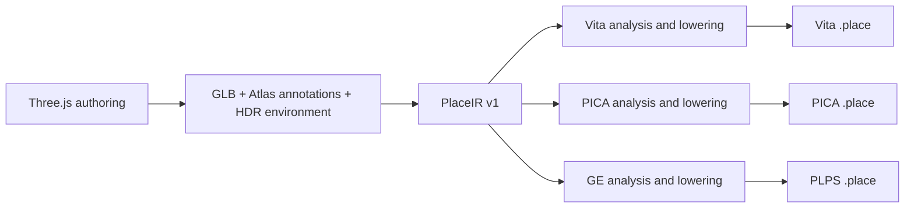

# Place compiler and shared device mechanisms

Pocket Atlas owns its authoring conventions, PlaceIR, cooking passes, device
packs and renderers. OpenStrike owns BSP/FPS behavior. Pocket3D names the family
of techniques used to build these systems. Sharing a device kernel does not
require sharing a scene engine, material model or runtime ABI.

## Milestone 1



All three cooks start from the same immutable source. PICA and GE no longer
parse a Vita pack, decompress its BC textures, or reconstruct positions from
its quantized vertices. Shared analysis passes still perform world transforms,
spatial chunking, lighting and animation sampling. PICA / GE now receive float
positions, normals, tangents and UVs and original material pixels. Their own
lowerings choose texture sizes/layouts, vertex layouts, lighting approximations,
batching and runtime data. Vita retains its existing encoding and shaders.

`crates/pocket3d-place-cook/src/ir.rs` implements import, integrity checks and
capability checks. `source.rs` describes transient shared-pass output; it is not
a serialized interchange format. `main.rs` still orchestrates the existing
analysis and Vita writer; `pica.rs` and `psp.rs` own native lowerings. Existing
`pocket3d-place::Meta` types are reused internally during this migration. They
are not the public definition of PlaceIR. The PlaceIR migration itself retained
device formats. Vita now uses PLCE/ATLS v7 and Place META v7 for vertex-PBR
palettes; older runtimes reject these packs.
PICA pins its PLCE envelope to v5 and its binary table to v3 independently.
PSP uses PLPS v3 with explicit texture precision and requires matching assets and renderer.
Previously a Vita version bump leaked into PICA output and the C reader rejected
it; the integration test now checks cooked output using the runtime's C format
header and header validator.

## PlaceIR v1

A directory contains:

- `manifest.json`: version, stable place name, kind, required known effects and
  SHA-256 of every resource. Unknown IR versions and changed resources fail.
- `scene.gltf`: canonical JSON using glTF 2.0 structure plus `extras.pocketAtlas`.
  It preserves authored nodes, materials, cameras, motion and Atlas annotations.
- `scene.bin`: the original GLB buffer, including original embedded images.
- `env.rgba16f` and the authored cloud image when referenced by scene metadata.

Import splits an exported GLB and seals its resources. It does not quantize
geometry, compress textures, bake lighting, choose LODs or discard metadata.
This is an incremental IR built on the existing structural schema, not a new
general-purpose scene language. No backend calls Three.js or requires a browser.
The exporter remains responsible for converting supported Three.js constructs
into geometry and annotations; arbitrary JavaScript, GLSL and gameplay code do
not become portable automatically. Sampled traffic contains the exported time
interval. Doors, camera controls and animation evaluation remain runtime code.

Reproducibility starts at a fixed export / PlaceIR and pinned compiler/dependency
revision. Procedural web authoring may use time or randomness; creating a new
export is not promised to reproduce an earlier export. Cook timing is kept out
of the device metadata so repeated cooks can produce identical bytes. Cross-OS
floating-point or compiler-version identity is not established by the current
same-host regression tests.

## Commands

Export a place using `web/scripts/export-place.ts`, then import it once:

```sh
cargo run --locked --release -p pocket3d-place-cook -- import \
  --in .pocket-build/places/tokyo-konbini \
  --out .pocket-build/places/tokyo-konbini/place.ir

# The export and browser are no longer needed after import.
for target in vita 3ds psp; do
  cargo run --locked --release -p pocket3d-place-cook -- check \
    --in .pocket-build/places/tokyo-konbini/place.ir --target "$target"
  cargo run --locked --release -p pocket3d-place-cook -- \
    --in .pocket-build/places/tokyo-konbini/place.ir --target "$target" \
    --out ".pocket-build/validation/tokyo-$target.place" --tex 256
done
```

The platform wrappers (`tools/atlas.ts cook`, `atlas-3ds.ts cook`,
`atlas-psp.ts cook`) import the current export before lowering. Passing an IR
folder to the compiler checks its hashes and does not modify it. A device pack
is never a compiler input. The removed `--pica-from` and `psp --in <pack>` forms
fail with a migration message.

`--tex` retains the Vita/PICA texture cap setting; PSP currently uses its own
128-pixel night / 256-pixel day material cap (512 for luminous maps). Output
suffixes do not identify a universal pack:
PICA has its own table and geometry layout; PSP uses the separate PLPS header.
PICA's higher-resolution exceptions inspect the authored 4K text-atlas
convention, animation grids and emissive strips. Ordinary 2K source maps obey
the texture cap; their original size must not be mistaken for a previously
resized Vita atlas. The writer checks the reader's per-section limits (4 MiB
table, 12 MiB textures, 24 MiB geometry, 16 MiB animation) before publishing.
These are structural ceilings; combined allocations and render targets still
need device headroom measurements.

## Capability, release eligibility and evidence

`check --target` rejects known missing lowerings before cooking. Currently
PICA/GE reject city-light fields and vista height haze. GE also rejects water
and kinds outside night streets and dry daytime
streets/slopes. Its shared daytime lowering bakes the sky and sun from the IR;
PLPS v3 records per-texture precision (RGBA8888 gradients/glossy maps, compact
RGBA4444 for other surfaces) and a bounded sky mesh. It does not
silently treat light-field point records as triangle records. Unsupported
material annotations fail rather than falling back to a standard material.
This is an initial capability gate, not an exhaustive Three.js feature checker.

The web registry's `targets` controls which native catalogs may publish a place;
`load` only means it can be entered on the web. In particular, Griffith stays
web/Vita-only and is not offered as runnable in the 3DS catalog. A compiler check
can reject a registered place if its authored feature requirements change.
Future device receipts can replace this manually maintained release eligibility.

A successful cook establishes asset construction and structural checks. A host
build establishes binding/link compatibility. Console launch, SceShaccCg
compilation, scene switching, visual fidelity and measured frame budgets are
separate checks. Native output has changed for PICA/GE because it now retains
source precision and avoids the BC round trip; existing hardware measurements
must not be treated as measurements of these new artifacts.

The regression test `tests/pipeline.rs` imports a small textured scene, deletes
the web export, compiles PSP and PICA before Vita, validates the PSP payload,
checks retained float precision and non-power-of-two texture fitting, then
repeats every cook byte-for-byte. Another fixture exercises the PICA sizing
policy with an ordinary 2K source image. IR tests cover retained unknown metadata,
version/capability and resource integrity. Run `cargo test --locked --workspace`.

## GXM ownership

`vendor/pocketjs/devices/vita/pocket-vita-gxm` contains the shared GXM memory,
program, patcher, target and texture mechanisms extracted from Atlas. Atlas uses
it directly. The existing BSP Vita renderer used by OpenStrike reuses its
mapped-memory and shader-registration operations, preserving its own shaders
and pass structure. Runtime SceShaccCg is an optional feature enabled by Atlas.
Both applications pin the same PocketJS revision; Atlas has no copied local GXM
crate. PocketJS continues to own hosts, transport and packaging.

The kernel exposes GXM concepts. Callers must wait for GPU completion before
freeing resources. It does not select lights, materials, visibility, quality
levels, frames, presentation or an application's device profile. Details and
lifetime rules are in the kernel's README.

## Next extractions

1. Separate the shared analysis result from legacy device metadata completely;
   move Vita serialization out of the orchestration module. Keep source IR
   stable and give target recipes/diagnostics explicit versions.
2. Move BSP/FPS renderer/compiler ownership toward OpenStrike without moving
   generic animation/mesh code or breaking PocketJS's existing widget consumers.
   The current BSP renderer still physically lives in PocketJS during this step.
3. Extract PICA/GE mechanisms from actual consumers when reuse is demonstrated.
   Do not create empty backends or a mandatory common GPU API first.
4. Add target profiles made of OS/ABI, GPU capabilities, budgets and presentation
   requirements. Steam Deck or an Android handheld such as AYN Thor can share
   suitable mechanisms while selecting different compiler recipes. A product
   name alone is not a rendering backend. No new device support is implied here.
5. Publish creator-facing validation, diagnostics and measured capability
   profiles. New scene kinds need a reviewed lowering and visual/performance
   evidence; agents may propose changes, while checked-in compiler passes make
   accepted decisions reproducible. Scene-specific generated patches are not
   part of the asset build.
