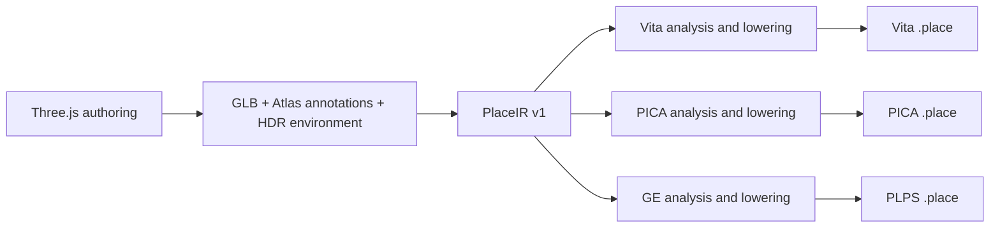

# Place compiler and shared device mechanisms

Pocket Atlas owns its authoring conventions, PlaceIR, cooking passes, device
packs and renderers. OpenStrike owns BSP/FPS behavior. Pocket3D names the family
of techniques used to build these systems. Sharing a device kernel does not
require sharing a scene engine, material model or runtime ABI.

## Compiler stages



All three cooks start from the same immutable source. PICA and GE no longer
parse a Vita pack, decompress its BC textures, or reconstruct positions from
its quantized vertices. Shared analysis passes still perform world transforms,
spatial chunking, lighting and animation sampling. PICA / GE now receive float
positions, normals, tangents and UVs and original material pixels. Their own
lowerings choose texture sizes/layouts, vertex layouts, lighting approximations,
batching and runtime data. Vita retains its encoding and shaders, including solid PBR palette batching.

`crates/pocket3d-place-cook/src/ir.rs` implements import, integrity checks and
capability checks. `source.rs` describes typed transient shared-pass output: float vertices,
logical index lists, original pixels, light points and sampled animation arrays.
It contains no device version, byte ranges or GPU vertex layouts.
`pocket-atlas-model` owns Atlas material, lighting and camera semantics; device
readers re-export those types for compatibility. `analysis.rs` applies scene
passes, while `vita.rs`, `pica.rs` and `psp.rs` own their encodings. `main.rs`
handles the CLI. The analysis representation is not a serialized interchange
format or a shared scene language for OpenStrike. Vita uses PLCE/ATLS v7 and
META v7. PICA independently pins its PLCE envelope to v5 and its binary table
to v4. PSP uses PLPS v4, combining explicit texture precision, a bounded sky
mesh, compact full-loop animation, LOD selection and optional audio. Native
runtimes reject older layouts; re-cook each affected target when updating the
application. All packs require their matching target readers.
Previously a Vita version bump leaked into PICA output and the C reader rejected
it; the integration test now checks cooked output using the runtime's C format
header and header validator.

The current recipes preserve full-attribute welds, deformation and palette
seams, bounded rigid simplification, world-scaled motion errors and oversized
triangle boundaries. Vita alone selects solid PBR palette batching and merges
GPU-identical encoded vertices; that representation never enters PICA/GE.
PICA keeps the two coarsest analysis LODs in its limited main-view slots. Vita
interns identical geometry/animation buffers at serialization. Unsupported skin
sizes fail before publication; omitted inverse-bind matrices use identity.

## PlaceIR v1

A directory contains:

- `manifest.json`: version, stable place name, kind, required known effects and
  SHA-256 of every resource. Unknown IR versions and changed resources fail.
- `scene.gltf`: canonical JSON using glTF 2.0 structure plus `extras.pocketAtlas`.
  It preserves authored nodes, materials, cameras, motion and Atlas annotations.
- `scene.bin`: the original GLB buffer, including original embedded images.
- `env.rgba16f` and the authored cloud image when referenced by scene metadata.

Import splits an exported GLB and seals its resources. It does not quantize
geometry, compress textures, bake lighting, choose LODs or discard metadata.
This is an incremental IR built on the existing structural schema, not a new
general-purpose scene language. No backend calls Three.js or requires a browser.
The exporter remains responsible for converting supported Three.js constructs
into geometry and annotations; arbitrary JavaScript, GLSL and gameplay code do
not become portable automatically. Sampled traffic contains the exported time
interval. Doors, camera controls and animation evaluation remain runtime code.

Authoring definitions now supply a checked seed/sampling/resource contract.
Fresh exports prevent preview time from advancing actors, use fixed sampling,
preserve source IDs and canonicalize asynchronous GLB buffer placement. The
export receipt seals source/resources and browser/GPU identity; matching fresh
exports are verified on the same recorded environment. Cross-browser/GPU identity
is not promised for procedural GPU baking. From a sealed PlaceIR and pinned
compiler/dependencies, target packs and compile receipts are repeatable without
a browser. See [Authoring](AUTHORING.md) for the complete creator workflow,
compatibility adapter, limits and device evidence contract.

## Commands

`bun tools/place.ts inspect|export|import|check|cook|build|report|recipe|profiles`
is the Atlas creator entry point. The Rust commands below remain available for
CI and callers that already have sealed inputs.

Export a place using `web/scripts/export-place.ts`, then import it once:

```sh
cargo run --locked --release -p pocket3d-place-cook -- import \
  --in .pocket-build/places/tokyo-konbini \
  --out .pocket-build/places/tokyo-konbini/place.ir

# The export and browser are no longer needed after import.
for target in vita 3ds psp; do
  cargo run --locked --release -p pocket3d-place-cook -- check \
    --in .pocket-build/places/tokyo-konbini/place.ir --target "$target"
  cargo run --locked --release -p pocket3d-place-cook -- \
    --in .pocket-build/places/tokyo-konbini/place.ir --target "$target" \
    --out ".pocket-build/validation/tokyo-$target.place" --tex 256
done
```

The platform wrappers (`tools/atlas.ts cook`, `atlas-3ds.ts cook`,
`atlas-psp.ts cook`) import the current export before lowering. Passing an IR
folder to the compiler checks its hashes and does not modify it. A device pack
is never a compiler input. The removed `--pica-from` and `psp --in <pack>` forms
fail with a migration message.

`--tex` overrides the selected profile's surface texture cap. PSP defaults to
128-pixel night surfaces, 256-pixel daytime surfaces and 512-pixel emissive/detail maps. PICA defaults to 256.
Profiles validate overrides against the selected backend's limits. Output suffixes do not identify a universal pack:
PICA has its own table and geometry layout; PSP uses the separate PLPS header.
PICA's higher-resolution exceptions inspect the authored 4K text-atlas
convention, animation grids and emissive strips. Ordinary 2K source maps obey
the texture cap; their original size must not be mistaken for a previously
resized Vita atlas. The writer checks the reader's per-section limits (4 MiB
table, 12 MiB textures, 24 MiB geometry, 16 MiB animation) before publishing.
These are structural ceilings; combined allocations and render targets still
need device headroom measurements.

## Capability, release eligibility and evidence

`check --target` rejects known missing lowerings before cooking. Currently
PICA/GE reject city-light fields and vista height haze. GE also rejects water
and kinds outside night streets and dry daytime streets/slopes. Its shared
daytime lowering bakes the sky and sun from the IR, with a separate drifting
cloud layer. GE analysis includes static sunlight before refinement/LOD, with
an explicit transient `baked_sun` marker to avoid applying it twice. Its
contact guard and intact source-window overlays are native sampling policies;
the authored IR and Vita/PICA sunlight paths remain independent (see
`psp/README.md`). PLPS v4 records per-texture precision: RGBA8888 for sky/cloud
gradients and glossy daytime maps, RGBA4444 for compact surface maps. It does not
silently treat light-field point records as triangle records. Unsupported
material annotations fail rather than falling back to a standard material.
This is an initial capability gate, not an exhaustive Three.js feature checker.

The web registry's `targets` controls which native catalogs may publish a place;
`load` only means it can be entered on the web. In particular, Griffith stays
web/Vita-only and is not offered as runnable in the 3DS catalog. A compiler check
can reject a registered place if its authored feature requirements change.
Future device receipts can replace this manually maintained release eligibility.

A successful cook establishes asset construction and structural checks. A host
build establishes binding/link compatibility. Console launch, SceShaccCg
compilation, scene switching, visual fidelity and measured frame budgets are
separate checks. The earlier PlaceIR migration changed PICA/GE output to retain source precision
and avoid the BC round trip. Format and recipe changes require fresh target
cooks and validation. Measurements still belong to the exact asset and runtime
identities tested; pre-integration results do not certify merged builds.

The regression test `tests/pipeline.rs` imports a small textured scene, deletes
the web export, compiles PSP and PICA before Vita, validates the PSP payload,
checks retained float precision and non-power-of-two texture fitting, then
repeats every cook byte-for-byte. Another fixture exercises the PICA sizing
policy with an ordinary 2K source image. IR tests cover retained unknown metadata,
version/capability and resource integrity. Run `cargo test --locked --workspace`.

## Profiles, recipes and compile receipts

`profiles/vita30.json`, `old3ds30.json` and `psp30.json` describe the existing
runtimes: host OS/ABI, GPU family, render/display dimensions, auxiliary display,
frame target, texture policies, animation palette budget and reader limits.
`--profile` accepts a built-in ID or a JSON file. A custom profile can tune the
supported recipe and reduce budgets; it cannot change the implemented host,
GPU, presentation contract or relax a reader's hard limits. Backend feature
support is checked independently. Unknown schema/recipe versions fail.

```sh
cargo run --locked --release -p pocket3d-place-cook -- profiles
cargo run --locked --release -p pocket3d-place-cook -- check \
  --in .pocket-build/places/tokyo-konbini/place.ir --profile old3ds30 --json
cargo run --locked --release -p pocket3d-place-cook -- \
  --in .pocket-build/places/tokyo-konbini/place.ir --profile old3ds30 \
  --out .pocket-build/validation/tokyo.3ds.place --json
```

Recipes expose named/versioned executed passes and GPU-specific decisions.
Reports retain material/object contributor sets through batching and map output
textures to source textures. These are material contributor sets, not exact
per-triangle or TypeScript-line attribution.

Every successful cook writes `<output-stem>.compile.json`; `--report` selects
another path. The report records the sealed source manifest/resources, compiler
source hash and Rust version, effective profile and hash, analysis settings,
artifact hash, section sizes, output texture layouts and diagnostics. The
compiler hash includes the relevant compiler/model/format sources, profiles,
manifests and dependency lock. Reports contain no timestamps or output paths.
Repeated builds from the same source and toolchain produce the same receipt.

`check` establishes capability eligibility and does not claim a built asset.
A cook establishes construction and structural budgets. Its receipt records
`device.status = "not-recorded"` and a frame budget that requires measurement.
Physical acceptance needs a separate record tying the pack hash and profile to
the installed runtime build, device, camera/quality settings, measured frame
windows and captures. A section-size check does not prove combined allocation
headroom, visual fidelity or a frame-time bound. No device certificate is
inferred from a successful compile.

Native animation formats retain full authored loop samples while deduplicating
constant and identical tracks. PICA v4 stores compact TRS tracks with quaternion
interpolation and an affine fallback. PLPS v4 uses its own compact tracks and GE
vertex layouts, with measured position error recorded in compile receipts.
These encodings are chosen from source floats by each backend, never from Vita
vertices or animation bytes.

`psp30` revision 2 makes its geometry recipe explicit: dry daytime streets/slopes use
8 m static cells, a 1 pixel LOD error, at most 5 mm packed vertex position
error, 0.25 texel UV error and 6 mm packed translation error. An explicit
`--cell` overrides the cell recipe; other targets and night streets retain
their own existing policy. These are acceptance limits for an encoding, not
promises that every batch is quantized: oversized or stricter inputs retain
source float data. Empty LODs with a positive error intentionally omit
subpixel parts; they must not fall back to full geometry.

PSP runtime clipping handles triangles whose projected vertices leave the
GE's 0–4096 guard range, including faces crossing the near plane. It preserves
winding, attributes and draw order; safe geometry keeps its resident indices.
Bounded local block caches accelerate the test without changing the compiled
mesh or depending on a particular camera. Source window openings remove
hidden competing faces across all targets, while explicit polygon-offset
decals preserve intentional overlays. Neither is a global depth-bias workaround.

Optional `extras.pocketAtlas.audio` v1 describes procedural wind, birds and a
railway pass. Typed analysis validates its timing and gains; native lowerings
store a small parameter record, not sampled PCM. The native mixers follow the
scene clock and camera, silence paused or muted playback, and restart envelopes
on seeks. Audio initialization and a person's listening check remain distinct
from a successful cook or host synthesis test.

Backends return complete artifacts to the CLI. Profile and reader checks run
before publication; a rejected budget leaves an existing output pack and its
receipt intact. `--json` emits a machine-readable result, or a structured error
on stderr. Normal mode keeps progress and writes the same receipt.

### Texture purpose

Material `extras.pocketAtlas.textureUsage` maps `albedo`, `normal`, `orm` and
`emission` slots to `surface`, `text-atlas`, `flipbook` or `emissive-strip`.
These are compiler intents; each backend selects its own size and encoding.
Explicit usage takes precedence over source dimensions and luminance. A shared
image can have different purposes in different materials.

```ts
import { materialTextureUsage, textureUsage } from "./shared/texture-usage";
textureUsage(letteringTexture, "text-atlas");
materialTextureUsage(material, { albedo: "surface" }); // overrides image intent
```

The shared atlas constructor accepts `{ usage: "text-atlas" }`; animated Sign
flipbooks annotate their purpose. The exporter transfers image defaults into
material annotations and preserves explicit slot overrides. Legacy exports
retain the versioned sizing rules and emit `ATLAS_LEGACY_TEXTURE_USAGE`
diagnostics. Annotating a legacy material can change its chosen resolution;
review the report and device evidence when adopting an explicit purpose.

## GXM ownership

`vendor/pocketjs/devices/vita/pocket-vita-gxm` contains the shared GXM memory,
program, patcher, target and texture mechanisms extracted from Atlas. Atlas uses
it directly. The existing BSP Vita renderer used by OpenStrike reuses its
mapped-memory and shader-registration operations, preserving its own shaders
and pass structure. Runtime SceShaccCg is an optional feature enabled by Atlas.
Both applications pin the same PocketJS revision; Atlas has no copied local GXM
crate. PocketJS continues to own hosts, transport and packaging.

The kernel exposes GXM concepts. Callers must wait for GPU completion before
freeing resources. It does not select lights, materials, visibility, quality
levels, frames, presentation or an application's device profile. Details and
lifetime rules are in the kernel's README.

## Domain and device ownership

OpenStrike now owns its BSP import, `.p3d` format, collision, cooker and
GE/GXM/GLES2 renderers under `open-strike/domain`. PocketJS retains generic
animation, mesh, desktop widget and VRM consumers. Atlas never consumes a BSP
renderer or converts through an OpenStrike device pack.

Atlas and OpenStrike share these pinned PocketJS mechanisms:

- `devices/psp/pocket-psp-ge`: retained aligned frame storage, GE byte layout and
  explicit cache writeback. Both cookers use its swizzle; Atlas uses the cache
  primitive, and PocketJS/OpenStrike use frame storage.
- `devices/3ds/pocket-3ds-pica`: checked texture allocation, exact complete-mip
  upload/publication and explicit release. Atlas loads its native payloads into
  this storage; the PocketJS host used by OpenStrike publishes its tiled images.
- `devices/vita/pocket-vita-gxm`: the existing GXM mechanisms described above.

Callers own GPU completion before reuse or release. Native types stay visible;
there is no common GPU API. Compiler fingerprints cover the shared GE source as
well as Atlas's recipe/format source and dependency lock.

## Creator workflow and next extensions

1. Build a web place using supported material/effect vocabulary. Export Three
   to GLB plus annotations, then import to the integrity-checked PlaceIR.
2. Choose a versioned profile, run `check`, and cook directly from PlaceIR. Typed
   analysis feeds each target writer; one device pack is never another's input.
3. Inspect the compile receipt's capabilities, dimensions, byte budgets and
   legacy warnings. Repeated identical inputs produce identical packs/reports
   with the same compiler/toolchain. Compilation is not a frame-time proof.
4. Deploy the identified pack and runtime, compare intended visuals, exercise
   every camera and record device timing against the profile's frame budget.
   Keep capture, interaction and timing evidence separate from host checks.
5. When a new scene kind needs a new effect or misses budget, a person or agent
   reviews the lowering and device evidence, then changes a general recipe,
   renderer mechanism or authoring intent. The reviewed decision becomes a
   versioned deterministic pass; manual edits to generated packs are not inputs.

This milestone supports the existing Vita, Old 3DS and PSP targets only. New
scene kinds still require measured capability records and visual acceptance.
Steam Deck and AYN Thor are deferred; no renderer or profile for them is added.
