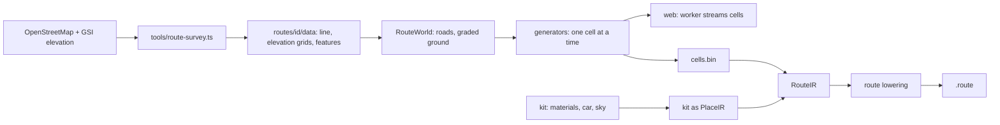

# Routes: open-world driving on a handheld

A place is one spot. A **route** is one real road, driven from one end to the
other at its true length. The first is National Route 237 from Asahikawa to
Furano in snow (`hokkaido-r237`, 50.8 km). A route cannot be one scene: it is
compiled into cells that a device streams as the car moves.

Routes follow the same rule as places and the same Pocket3D direction: the
web reference is the work; a compiler turns it into what each device runs
best. Nothing here is a general engine. The pieces are a route compiler, a
streaming format and a small simulation crate, and they reuse the place
pipeline wherever a route is a place (materials, sky, light, look, the car).



## Survey (`tools/route-survey.ts`)

`web/src/routes/<id>/survey.json` names the road (an OSM `ref`), the two ends
and the corridor widths. The tool finds the driven line (shortest path over
the numbered road's ways, local streets only at the ends), fetches what
stands in the corridor and resamples the GSI elevation tiles into three
grids, all in one frame: Japan Plane Rectangular CS XII moved to a local
origin, +X east, −Z north, y metres above sea level
(`routes/shared/geodesy.ts`). Raw downloads stay in
`.pocket-build/research/<id>/`; the distilled files are checked in under
`web/src/routes/<id>/data/` (3.8 MiB for Route 237):

| File | Contents |
| --- | --- |
| `route.json` | frame, length, road names, speed limits |
| `centerline.bin` | the driven line every 5 m: x, z, y, lanes, limit, bridge flag |
| `features.bin` | roads, rails, buildings, land cover, water, power lines, points (deflated JSON, decimetres) |
| `dem-near.bin`, `dem-mid.bin`, `dem-far.bin` | elevation at 10 m within 2.2 km, 40 m within 9 km, 160 m within 45 km |

The road's own profile is the ground under the line smoothed over 60 m, with
bridges strung between their abutments and grades held under 7 %. What is
estimated (ploughed widths, bank heights, anything OSM does not record) is
made by the generators, not by the survey.

## World and generators (`web/src/routes/shared`)

Everything here is plain TypeScript without three.js or the DOM: it runs in
the page's worker, and under Bun for the export.

- `RouteWorld` (`world.ts`): the driven road and every ploughed road of the
  corridor as centre lines with a profile; `base(x, z)`, the terrain graded
  to the roadbeds; `probe(x, z)`, the signed distance to the edge of the
  ploughed area; `bank(e, s)`, the snow a plough leaves beyond that edge.
  Banks follow the edge of the union of the ploughed bands, so a side road
  opens the main road's bank where it joins.
- Layers and cells (`layers.ts`): four layers tile the ground. Which cells
  exist is fixed by the line; a device loads each layer's cells within its
  radius of the camera.

  | Layer | Cell | Exists within | Loads within | Holds |
  | --- | --- | --- | --- | --- |
  | `detail` | 256 m | 360 m of the line | 640 m | poles, signs, wires, near trees |
  | `base` | 256 m | 360 m | 2.4 km | roads and banks, terrain at 8 m, buildings, woods |
  | `mid` | 1024 m | 4 km | 7.2 km | terrain at 32 m, canopy |
  | `far` | 8192 m | 28 km | all | terrain at 512 m |

  A coarser layer still covers the ground under a finer one, sunk below it
  (5 m, 40 m), so an unloaded finer cell leaves no hole; where a finer
  layer's coverage ends its edge vertices lie on the coarser lattice, so the
  two meet without a crack.
- Generators (`gen/*.ts`, listed per layer in `cell.ts`): each puts
  triangles into a `MeshBuilder` by **kit material name**, for one cell. A
  thing belongs to the cell that holds its anchor (a building's centroid, a
  tree's foot, a quad's centre), so neighbours never draw it twice.
  Generators are deterministic: the same cell is the same bytes every time.
- The kit (`kit/`): the materials by name (`kit/materials.ts` and one file
  per generator), the car (`kit/car.ts`). Vertex colours are sRGB bytes.
- The drive (`drive/`): the car (`vehicle.ts`, a single-track model on packed
  snow), the trip from stop to stop (`trip.ts`), the driving cameras
  (`chase.ts`) and an autopilot for measurements (`autopilot.ts`).

`RouteStage` puts these in the page: it streams cells from the worker,
drives the car and draws the display. As a place stage it also exports the
kit for the cooker.

## RouteIR and the Vita lowering

```sh
# Kit: a place export (dev server running), then the world under Bun.
(cd web && bun scripts/export-place.ts --place hokkaido-r237 --seconds 1 --out ../.pocket-build/routes/hokkaido-r237/kit)
(cd web && bun scripts/export-route.ts --route hokkaido-r237)      # [--km 0,3] for a stretch
bun tools/atlas.ts cook-route --route hokkaido-r237                 # → .pocket-build/routes/<id>/<id>.route
```

RouteIR is a directory: `kit/` (a place export; the cooker seals it as
PlaceIR), `route.json` (length, layers, stops, limits, the car, views),
`line.bin` and `cells.bin` (every cell as float geometry by material name).
A kit material reaches the compiler through its swatch in the kit export; a
cell that names a material the kit lacks fails the cook.

`pocket-atlas-cook route` (`crates/pocket3d-place-cook/src/route.rs`) cooks
the kit with the place pipeline, then every cell on its own, in parallel:

- **Light is baked along the road.** There is no sun on a snowy afternoon:
  each vertex takes the hemisphere and the probe's diffuse light, scaled by
  the share of the sky it sees past the banks, trees and walls within 5 m
  (24 rays against its own and its neighbours' cells).
- **Reduced levels per draw**, by layer (15 cm, 60 cm and 2.4 m in the
  corridor; up to 40 m for the far hills), with every open border of a
  mesh held so cells stay sealed; thin parts vanish from a level once they
  are narrower than its error.
- **Each cell quantized in its own frame** into the Vita layouts of the
  place renderer, as one blob: a header, draw records, vertices, indices.

The pack (`crates/pocket3d-place/src/route.rs`, magic `ROUT`) nests the kit
as a `.place`, then the line, the cell index and the blobs. Only Vita has a
lowering; `--target 3ds|psp` is refused and the RouteIR stays intact.

## Vita runtime (`vita/src/drive`)

A route is entered like a place. The kit loads as the place's scene and the
place renderer draws it unchanged; the drive adds:

- **Streaming** (`stream.rs`): a thread reads cells straight into
  GPU-mapped memory from a pool; ready cells' draws join the scene's draw
  list; a dropped cell's memory waits four frames for the GPU before reuse.
- **A render origin.** The route is 42 km across and single-precision
  positions resolve 2–4 mm there, visible on a car 5 m from the camera.
  Everything handed to the renderer is relative to an origin on a 1024 m
  grid near the camera, moved when the camera is 2 km from it.
- **The simulation** (`crates/pocket3d-drive`): the port of the web's
  `line.ts` and `drive/*.ts`, statement for statement in f64. A trace
  written by `web/scripts/vehicle-trace.ts` (150 s of scripted controls and
  autopilot) is replayed by `cargo test -p pocket3d-drive` and must match
  to 10⁻⁶.
- **Falling snow** (`fx_v.cg`/`fx_f.cg`, `FLAKE`; `Meta::snow`): flakes in a
  box around the camera, drawn along their velocity relative to it.
- **The display** (`hud.rs`) and the trip: stops reached are saved to
  `route-<id>.json` in the data folder; a trip resumes from the last one.

Development builds copy a route pack from the USB share to
`ux0:data/pocket-atlas/routes/` when its stamp changes (cells need seeks,
which the share does not serve).

Controls: left stick or D-pad steers, R or × drives, L or □ brakes and
reverses, △ changes the view, ○ hands the camera to the place rig and back,
START pauses. Control messages: `{"place": "<id>", "drive": {"km": 12.5,
"auto": 60, "view": "hood", "look": false}}`. `bun tools/atlas.ts drive
--from 0 --to 5 --kmh 60` drives a stretch on autopilot and reports frame
time, draws, triangles and cells per kilometre.

## Limits

- The car stays on the driven road; side roads are drawn, not driven.
- One weather and hour per route; the light does not change along the way.
- The dual carriageway north of the start is outside the route.
- No traffic, pedestrians or sound on the handheld yet.
